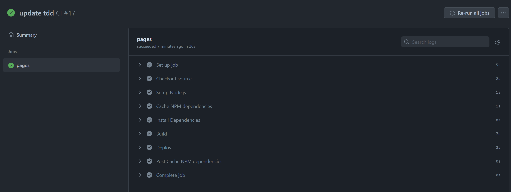

最近发现`.top`的域名经常会被各种不友好防火墙封杀（比如公司网络），就给博客换了个新的域名[`sonnyhcl.com`](https://sonnyhcl.com)。

博客之前是基于 GitHub Pages+Hexo+Next Mist+Travis CI 搭建的，详情请参考这篇博客（[Hexo+GitHub 搭建个人博客](../2019-04-27-hexo-github-page-blog.md)。
正巧发现 Travis CI 已经被 deprecated 不能正常工作了，就想着尝鲜用 GitHub Action 来做自动集成。

<!-- more -->

## GitHub Action 定义

GitHub Action 的文件定义在`.github/workflows`文件夹下，每个 yaml 文件存着对应的 GitHub Action 的定义，当然本质上它就是一层套了壳的 Azure Pipeline，所以看起来会跟 Azure Pipeline 极度相似。如下所示是本博客所使用的 GitHub Action 定义。

```yaml
name: CI

on:
  push:
    branches: [source]

env:
  GIT_USER: "" # Your display name
  GIT_EMAIL: "" # Your git email address
  DEPLOY_REPO: "" # Your repo
  DEPLOY_BRANCH: master

jobs:
  pages:
    runs-on: ubuntu-latest

    steps:
      - name: Checkout source
        uses: actions/checkout@v1
        with:
          ref: source

      - name: Setup Node.js
        uses: actions/setup-node@v2.1.5

      - name: Cache NPM dependencies
        uses: actions/cache@v2
        with:
          path: node_modules
          key: ${{ runner.OS }}-npm-cache
          restore-keys: |
            ${{ runner.OS }}-npm-cache

      - name: Install Dependencies
        run: npm install

      - name: Build
        run: npm run build

      - name: Deploy
        uses: peaceiris/actions-gh-pages@v3
        with:
          github_token: ${{ secrets.GITHUB_TOKEN }}
          publish_dir: ./public
          publish_branch: master # deploying branch
```

定义好 GitHub Action 之后，每次 source 分支有新的 commit，都会自动触发 GitHub Action 对 source 分支进行一次新的 build，并把 build 好的静态文件内容发布到 master 分支上去，整个过程大约在 30s 左右完成，随后就可以看到我挂在 GitHub Pages 上的博客网站已经自动更新了。


